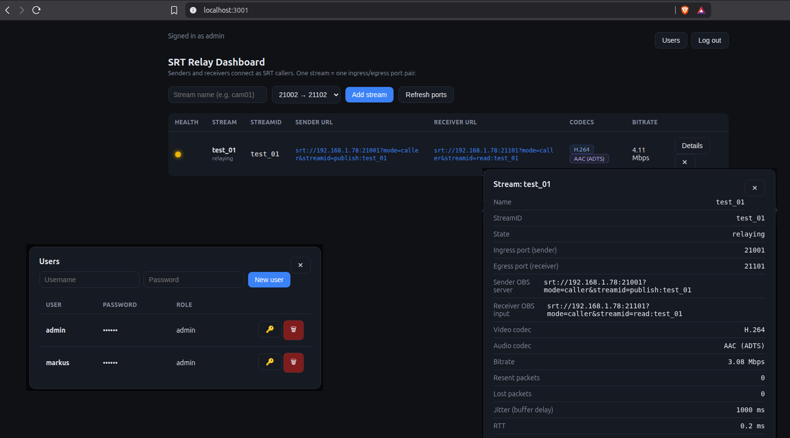

# SRT Relay Dashboard

A lightweight SRT relay with a built-in web dashboard. It forwards SRT streams
from one port to another (ingress -> egress), so **both the sender and the
receiver can connect as SRT callers** — no streamid required, no inbound NAT
hole-punching, no client configuration beyond the URL.

Built for the scenario where a relay server with a fixed public IP sits between
two NAT'd machines (senders and receivers behind firewalls that only allow
outbound traffic).



## Highlights

- **Per-port relay**: each stream = one ingress/egress port pair. Because the
  mapping is by port, neither OBS side ever needs to send a streamid.
- **No transcoding**: packets are copied as-is (`-c copy` equivalent), so CPU
  cost per stream is tiny. 20+ streams run comfortably on a 2 vCPU VM.
- **Codec detection**: sniffing MPEG-TS PAT/PMT tables, the dashboard shows the
  video/audio codec of every incoming stream (H.264, HEVC, AAC, ...).
- **Live health stats**: bitrate, resent packets, lost packets, jitter (TSBPD
  buffer delay) and RTT, with a color-coded health light per stream.
- **Dynamic stream management**: add/remove streams from the web UI, picking a
  free port from a dropdown. No config-file editing or restarts.
- **Single static binary** for Linux (Go + libsrt), deployed with one file.

## Architecture

```
Sender OBS (SRT caller) ──► srt://server:IN_PORT
                                    │
                          ┌─────────▼──────────┐
                          │   srt-relay-app    │
                          │  (one goroutine    │
                          │   per stream)      │
                          └─────────┬──────────┘
                                    │
Receiver OBS (SRT caller) ◄── srt://server:OUT_PORT
```

- **Sender OBS** connects *out* to the server's ingress port.
- **Receiver OBS** connects *out* to the server's egress port.
- The relay forwards packets between the two sockets while collecting SRT
  statistics and parsing codec metadata.
- The web dashboard (HTTP + WebSocket) shows live status for all streams.

### Port pairing

By default the egress port = ingress port + 100 (`--egress-offset`):

| Stream | Sender connects to | Receiver connects to |
|--------|--------------------|----------------------|
| 1      | `srt://HOST:23001` | `srt://HOST:23101`   |
| 2      | `srt://HOST:23002` | `srt://HOST:23102`   |
| ...    | ...                | ...                  |

## Quick start

### Easiest: download a release binary (Linux)

1. Grab the latest Linux binary + `libsrt.so.1.5.6` from the
   [Releases](https://github.com/markusnygard/srt-relay-dashboard/releases) page.
2. Put both in the same folder on the server and run:

```bash
cd ~
mkdir -p srt-relay && cd srt-relay
wget https://github.com/markusnygard/srt-relay-dashboard/releases/download/v0.1.0/srt-relay-dashboard-linux-amd64
wget https://github.com/markusnygard/srt-relay-dashboard/releases/download/v0.1.0/libsrt.so.1.5.6
chmod +x srt-relay-dashboard-linux-amd64
```

3. Run the relay:

```bash
export LD_LIBRARY_PATH=$(pwd)
./srt-relay-dashboard-linux-amd64 --http 0.0.0.0:3001
```

4. Open `http://SERVER:3001` and sign in with the default `admin` / `admin`
   credentials.

> Note: the binary needs the matching `libsrt` shared library at runtime.
> Keep `libsrt.so.1.5.6` next to it and set `LD_LIBRARY_PATH=$(pwd)` (or run
> the Docker image, which bundles everything).

### Option A: Docker image

```bash
docker build -t srt-relay-dashboard .
docker run --rm -d \
  -p 3001:3001 \
  -p 23001-23100:23001-23100/udp \
  -v $(pwd)/users.json:/users.json \
  srt-relay-dashboard \
  --http 0.0.0.0:3001 --users /users.json
```

### Option B: Standalone binary (recommended for the relay server)

1. Build the static binary (see [BUILD.md](BUILD.md)).
2. Copy `srt-relay-app` and `libsrt.so.1.5.6` to the server.
3. Run:

```bash
export LD_LIBRARY_PATH=$(pwd)
./srt-relay-app \
  --http 0.0.0.0:8080 \
  --port-low 23001 \
  --port-high 23100 \
  --egress-offset 100
```

### Using the dashboard

1. Open `http://SERVER:3001` and sign in (`admin` / `admin`).
2. Type a stream name and pick a free ingress port from the dropdown.
3. The dashboard shows the exact URLs to put in OBS:

   - **Sender OBS** → Settings → Stream → Custom → Server: `srt://SERVER:IN_PORT?mode=caller&streamid=publish:STREAMID` (Stream Key empty)
   - **Receiver OBS** → add Media Source → Input: `srt://SERVER:OUT_PORT?mode=caller&streamid=read:STREAMID` → Input Format: `mpegts`

   The dashboard shows these complete URLs for each stream; just copy them.

4. The stream row turns **relaying** and shows bitrate/codecs/health once both
   sides connect.

## Command-line options

| Flag | Default | Description |
|------|---------|-------------|
| `--http` | `0.0.0.0:3001` | web UI listen address |
| `--host` | `0.0.0.0` | SRT bind host |
| `--latency` | `1000` | SRT latency in ms (raise for lossy links) |
| `--port-low` | `21001` | lowest available ingress port |
| `--port-high` | `21100` | highest available ingress port |
| `--egress-offset` | `100` | egress port = ingress + offset |
| `--host-ip` | auto | IP shown to senders/receivers in the web UI (auto-detected if empty; set it if the relay is behind NAT or has multiple NICs) |
| `--users` | `users.json` | path to the users file (created with `admin/admin` on first run) |

## Authentication

The web UI requires a login (all users have admin role). On first run a
`users.json` file is created with the default credentials:

- **username:** `admin`
- **password:** `admin`

Change it immediately after first login via the **Users** button in the top
right of the dashboard: add new users, delete users, and reset passwords
(🔑). Passwords are stored **hashed (bcrypt)** and are never returned by the
API; the list shows a masked value.

## HTTP API

All endpoints except `POST /api/login` require a session cookie (obtained from
login). `POST /api/logout` is also public so a client can always sign out.

| Method | Path | Description |
|--------|------|-------------|
| POST | `/api/login` | `{"user": "...", "pass": "..."}` — sets session cookie |
| POST | `/api/logout` | clears the session |
| GET  | `/api/me`       | current user |
| GET  | `/api/users`    | list users |
| POST | `/api/users/add` | `{"user": "...", "pass": "..."}` |
| DELETE | `/api/users/{user}` | remove a user |
| GET  | `/api/config`   | host / port ranges |
| GET  | `/api/streams`       | list streams with stats |
| POST | `/api/streams/add`   | `{"name": "...", "inPort": 21001}` |
| DELETE | `/api/streams/{id}` | remove a stream |
| GET  | `/api/ports/free`    | list free ingress ports |
| WS   | `/ws`                | live stream updates |

## Health light logic

| Color | Meaning |
|-------|---------|
| 🟢 green | bitrate stable, loss < 0.1%, low buffer delay |
| 🟡 yellow | rising jitter / loss 0.1–1% / bitrate dipping |
| 🔴 red   | no traffic, loss > 1%, or buffer delay > 1000 ms |
| ⚪ gray  | no connection yet |

## Platform support

| Platform | Status | Notes |
|----------|--------|-------|
| Linux   | ✅ supported | primary target; single static-ish binary + `libsrt.so` |
| macOS   | ✅ supported | build with `./build.sh darwin` |
| Windows | ⚠️ not recommended | `srtgo` (the Go SRT binding) crashes under cgo on Windows (`0x406d1388` in `srt_startup`) — a binding/toolchain issue, not this app. Use Linux or macOS, or run the Docker image. |

## License

MIT — see [LICENSE](LICENSE).
